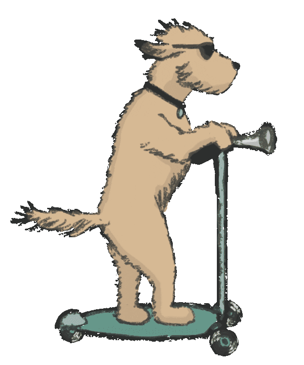

<!--
**JapeshBagga/JapeshBagga** is a ✨ _special_ ✨ repository because its `README.md` (this file) appears on your GitHub profile.
-->

### Hi Future Developers 👋

<!--- 🔭 I’m currently working on front End -->
- 👯 I’m looking to collaborate on developing and improving my repositories
- 🤔 I’m looking for help with Front End
- 💬 Ask me about Project, New Technology, Cloud, AI
- 😄 NickName: JP
- 📫 How to reach me: Email me at japbag2005@gmail.com
- 🥅 2021 Goals: Contribute more to Open Source projects
- ⚡ Fun fact: I don't like slow laptop and pc but love watching about businesses

---

## Connect with me

  
  <!---->
  
  

 

## Tools & Technologies:

    ] 
     
     
     
     
     
     
     
     
     
     
     
     
     
    
     

  
  

---

  

